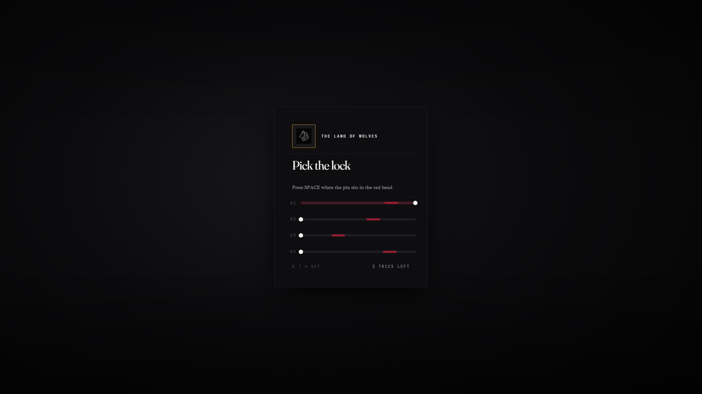

# lxr-lockpick — Lockpicking minigame, for LXRCore

A skill-based lockpicking minigame on the LXRCore v3 API. Another resource
(usually `lxr-doors`) triggers it with a client event and expects a report
back when the player finishes:

```lua
-- lxr-doors triggers on the client:
TriggerEvent('lxr-lockpick:client:start', { door = 'val_sheriff_front', label = "Sheriff's Office", report = 'lxr-doors:server:picked' })
-- when the minigame ends the resource must do:
TriggerServerEvent(data.report, data.door, broke)   -- broke = true when the pick snapped
```



## What it does

* **Pin alignment** — each pin sweeps left to right across a track; press
  SPACE when it sits inside the red band. Miss too many times and the pin
  costs a try; exhaust tries and the pick may snap.
* **Configurable difficulty** — `Config.Game.pins`, `speed`, `band` width,
  `breakChance`, and `maxTries` all live in `config.lua`.
* **Theme-aware NUI** — honours `LXRCore.Brand.theme` (night / morning) via
  the LXR UI Kit. No hex colours in `style.css`; everything comes from kit tokens.
* **Bilingual** — strings come from `locales/en.lua` + `locales/ka.lua`.

## Install

```cfg
ensure lxr-core
ensure lxr-lockpick
```

## Configuration

`config.lua` — `Config.Lang`, `Config.Game` (pins, speed, band, breakChance, maxTries),
`Config.Security.rateLimit`, `Config.Debug.printBanner`.

## API

| Name | Side | Purpose |
|---|---|---|
| `lxr-lockpick:client:start(data)` | client | trigger the minigame; `data.door`, `data.label`, `data.report` |
| `Start(data)` (export) | client | same as the event, callable from other resources |
| `result` (NUI callback) | client | `{ ok, broke }` — posts back to the trigger resource |
| `close` (NUI callback) | client | player pressed ESC |

## Licence

© 2026 iBoss21 / LXRCore — All Rights Reserved. See `LICENSE`.
